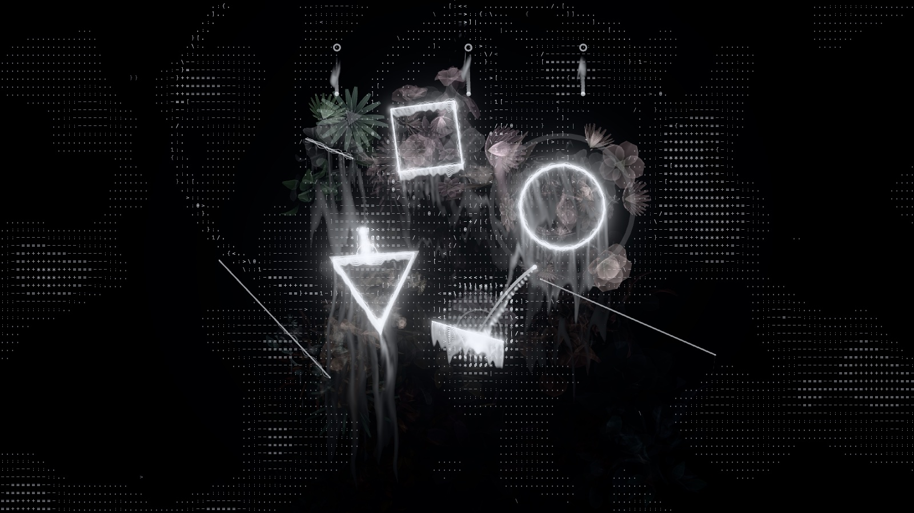

# otosu

[English](README.md) | 日本語

落として、当たって、光って、鳴る。

落ちてくるボールが線や図形に当たって音を鳴らす、生成音楽のビジュアル作品です。
楽器が弾けなくても感覚的に音楽を作れて、プロジェクターで投影したときに映えることを目指しています。

**すぐに試す: <https://otosu.shunyakoide.com>**



## 動作環境

- WebGL 2 が使えるブラウザ（最近の Chrome / Edge / Firefox / Safari。PC でもスマホでも動きます）
- 音は最初のクリックかタップのあとに鳴り始めます（ブラウザの自動再生の制限のため）
- MIDI のライブ出力には Web MIDI が必要で、実際には Chromium 系のブラウザに限られます。.mid の録音はどのブラウザでもできます

## 開発

Node.js 20.19 以上が必要です。

```bash
npm install
npm run dev
```

```bash
npm test       # 物理の決定論性・すり抜けなし・MIDI 書き出しなどのテスト
npm run lint   # Biome
npm run build  # 型チェックと本番ビルド（dist/）
```

Vite + TypeScript + three.js + Tone.js で作っています。物理（ボールと線分の衝突）は自前で、同じ配置なら毎回同じ曲になります。

### 自分の環境にデプロイする

`npm run build` で `dist/` に静的サイトができるので、静的ホスティングならどこにでも置けます。
`npm run deploy`（Cloudflare Workers）を使う場合は、先に `wrangler.jsonc` の `routes` の行（作者のドメイン）を消してください。`otosu.<あなたのサブドメイン>.workers.dev` で公開されます。

## 操作

| 操作 | 内容 |
|---|---|
| ドラッグ | 線や図形を描く（大きいほど低い音。描いている途中も音程が小さく鳴る） |
| 1〜5 | 道具: 線 / ペン（手描き） / 円 / 三角 / 四角。図形はドラッグの始点が中心、距離が大きさ |
| Shift + ドラッグ | バンパー（強く跳ね返す）を描く |
| 右クリック（タッチは長押し） | 図形のメニュー: エフェクト echo / rise / chord を付け外しする、図形を消す |
| Space | 再生／停止（止めるとボールを出すのをやめ、ゆっくり止まる） |
| M | ミュート（内蔵音と MIDI 出力） |
| C | 図形を全部消す |
| S | 今の配置を URL にしてコピー（開くと同じ曲が再現される） |
| R | .mid の録音を開始／停止（停止するとファイルを保存） |
| F | フルスクリーン |
| H | UI を隠す（投影用） |
| , | settings を開く |
| Esc | 開いている小窓を閉じる |

画面上端のツールバーには次のものが並んでいます。

- 再生／停止
- 道具
- テンポ（ホイールでも変えられる）
- 音量とミュート
- 全消去
- 小窓: motion / light / sound / settings / scenes
- フルスクリーン（対応環境のみ）

| 小窓 | 内容 |
|---|---|
| motion | 動きのオン／オフ（move）、図形の回転（spin）、放出口の揺らぎ（sway）とその動き方（glide / step） |
| light | 光の強さ、軌跡の描き方、当たったときの演出（drip / flowers と花の種類: いろいろ・ひまわり・彼岸花・デイジー・花畑 / readout / crosshair / notes / scope / stars）、背景の種類 |
| sound | リズム（放出口の周期）、曲（和音の進み方）、背景で鳴り続ける和音（hum） |
| settings | ステレオの広がり、音と光のずれ（light delay）、解像度、画質（自動 / 固定）、MIDI、キー操作の一覧 |
| scenes | 配置の保存と読み込み、ファイルへの書き出し・読み込み、リンクのコピー |

図形の形で楽器が変わります。

| 形 | 音 |
|---|---|
| 線 | ベル（旋律） |
| ペン | はじく音（カリンバ風） |
| 円 | 柔らかいキック〜タム。和音の根音に合わせ、大きい円ほど低い |
| 三角 | 金属（チャイム／シンギングボウル風）、余韻が長い |
| 四角 | 木のクリック（ウッドブロック風） |

ハーモニーは8小節ごとに移ろいます。曲は sound の小窓で選べます。
- bright: C–F–C–G
- dusk: Cm–A♭–E♭–B♭（短調）
- wistful: F–G–Em–Am
- still: 和音が変わらない

線の色は変わらず、音高だけが動きます。配置と設定はブラウザに自動で保存され、リロードしても戻ります。

## MIDI 出力（GarageBand / DAW と連携）

### 録音して読み込む（いちばん簡単）
1. R キー（または settings の `MIDI` → `record .mid`）で録音を始める。次の拍の頭から記録される
2. もう一度 R で止めると `otosu-日付-時刻.mid` が保存される
3. GarageBand にドラッグ＆ドロップすると、ソフトウェア音源のトラックとして読み込まれる

### ライブで送る（Mac の IAC Driver 経由、Chrome などの Chromium 系ブラウザが必要）
1. 「Audio MIDI 設定」アプリ → メニューの「ウインドウ」→「MIDI スタジオを表示」
2. 「IAC ドライバ」をダブルクリックし、「装置はオンライン」にチェックを入れる
3. settings の `MIDI` → `connect` を押し、ブラウザの許可ダイアログで許可する（出力を未選択なら、IAC があれば自動で選ばれる）
4. GarageBand でソフトウェア音源のトラックを作ると、otosu の音で鳴る（GarageBand はすべての MIDI 入力を受け取る）
5. 円（キック・タム）と四角（ウッドブロック）は GM ドラムとして `drums` のチャンネル（既定 10）に送る。録音した .mid でも同じ
6. 内蔵音と二重に鳴るのが気になる場合は `built-in` をオフにする。DAW 側の遅れは `offset` で合わせる

## ドキュメント

設計の経緯を日本語で残しています。

- [docs/concept.md](docs/concept.md) — コンセプト、最初に決めたこと、ロードマップ
- [docs/design/decisions.md](docs/design/decisions.md) — 設計判断の記録（D1〜）。ほかの文書と食い違うときはここが優先
- [docs/design/](docs/design/) — 初期（ステップ1・2）の設計案。音・描画・物理とアーキテクチャに分けて書いた

## ライセンス

[MIT](LICENSE)
